<b> SocialMediAPI using FastAPI </b>

This social media API has basic social media actions performable, [Requires a registered user]
<li> Create a post
<li> Read post/posts
<li> Update a post
<li> Delete a post
<li> Like or Dislike a post
<li> Follow or unFollow a user
<li> Get all users 
and more functionalities...
</li>

### Access the website : http://poweredbyapi.herokuapp.com/docs

## Social Media API tested using POST MAN

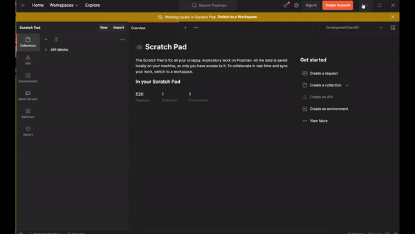
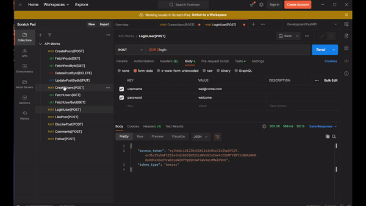
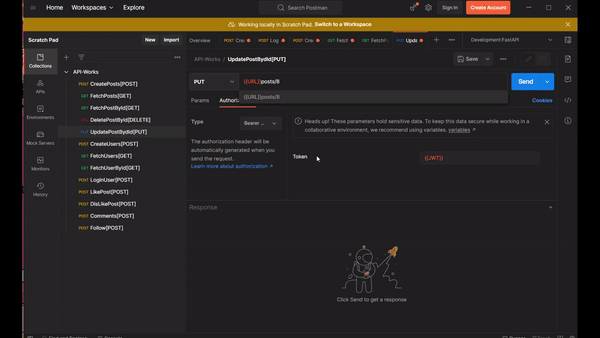
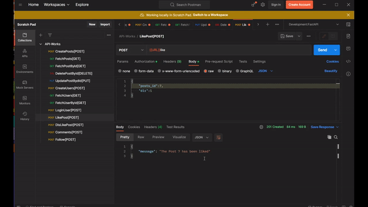
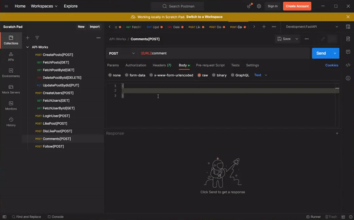
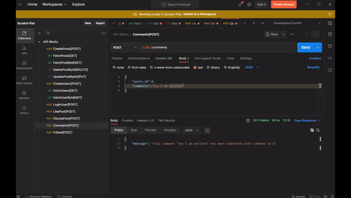
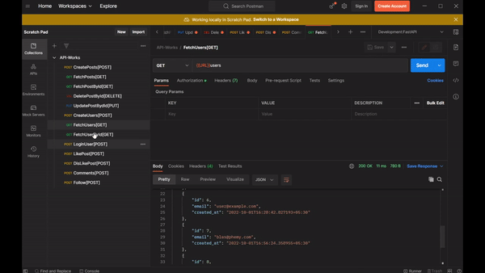

## Social Media API tested using localhost

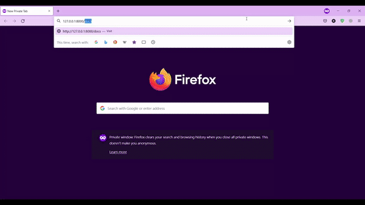
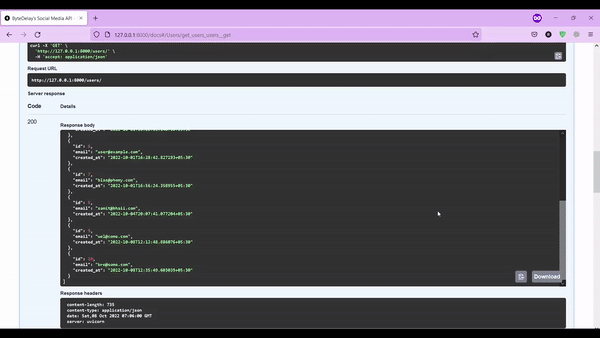
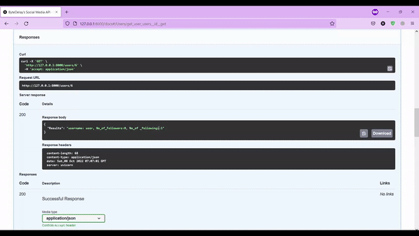
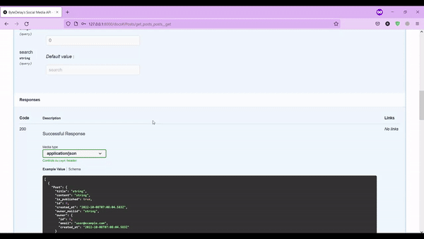
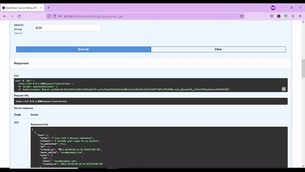
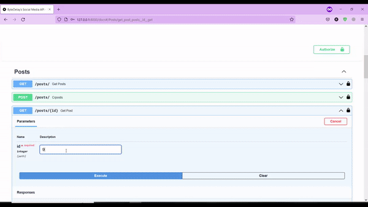
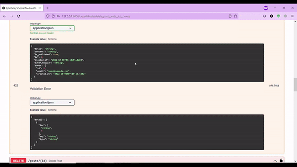
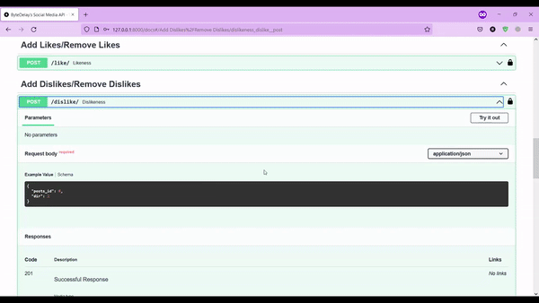
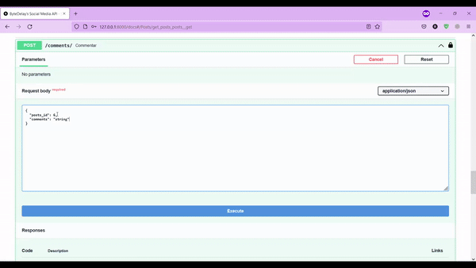
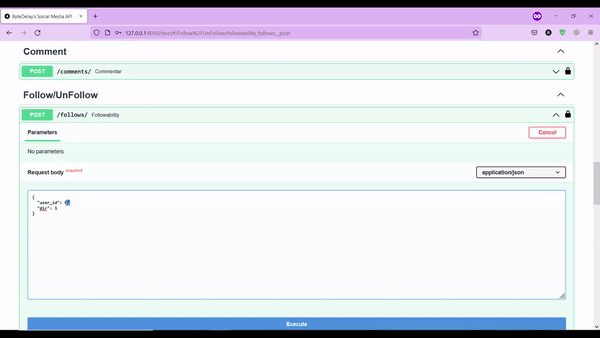

### Future Scope

Improve efficiency, implement more features without breaking the current implementation.

